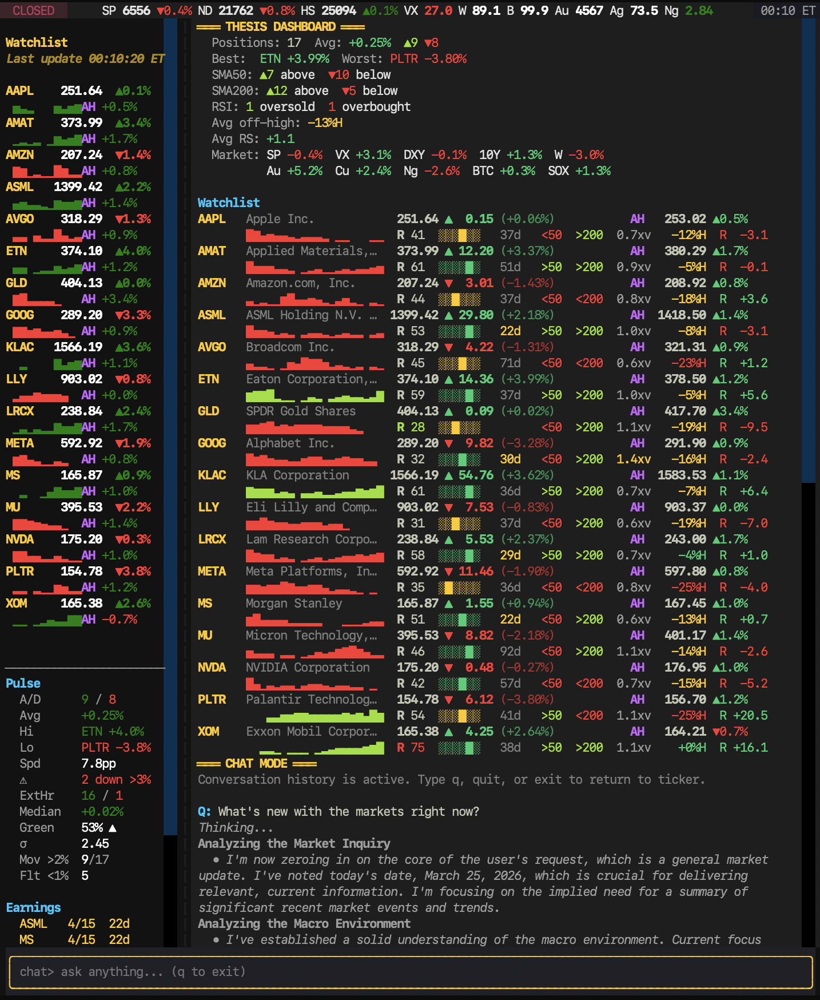
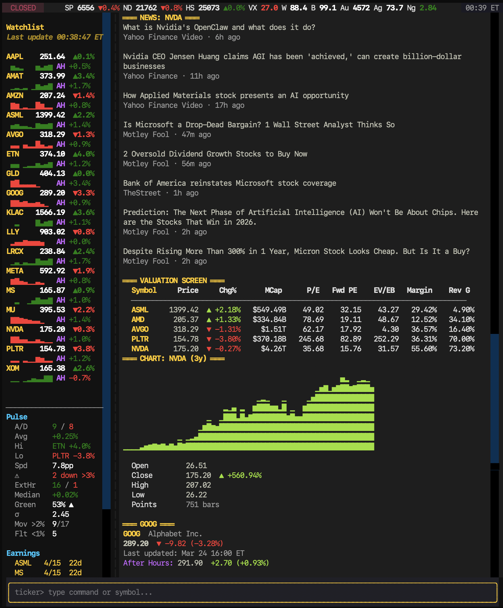
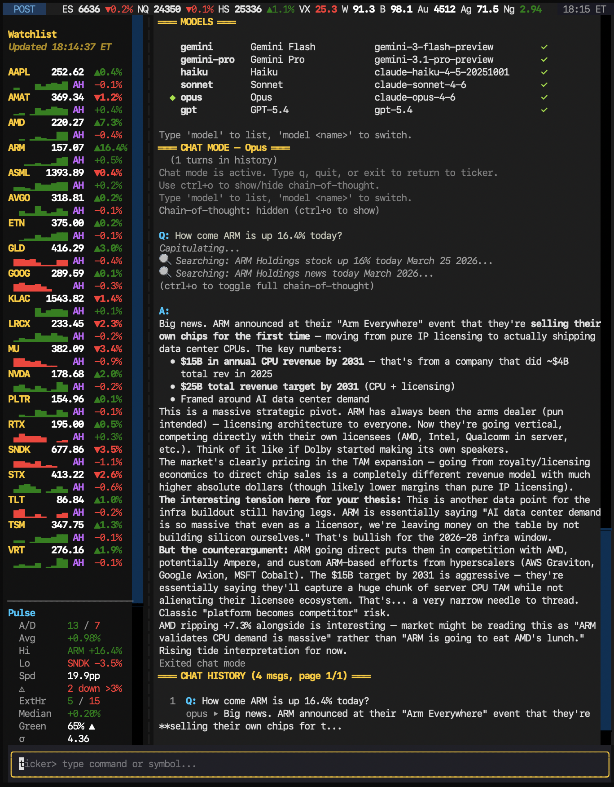
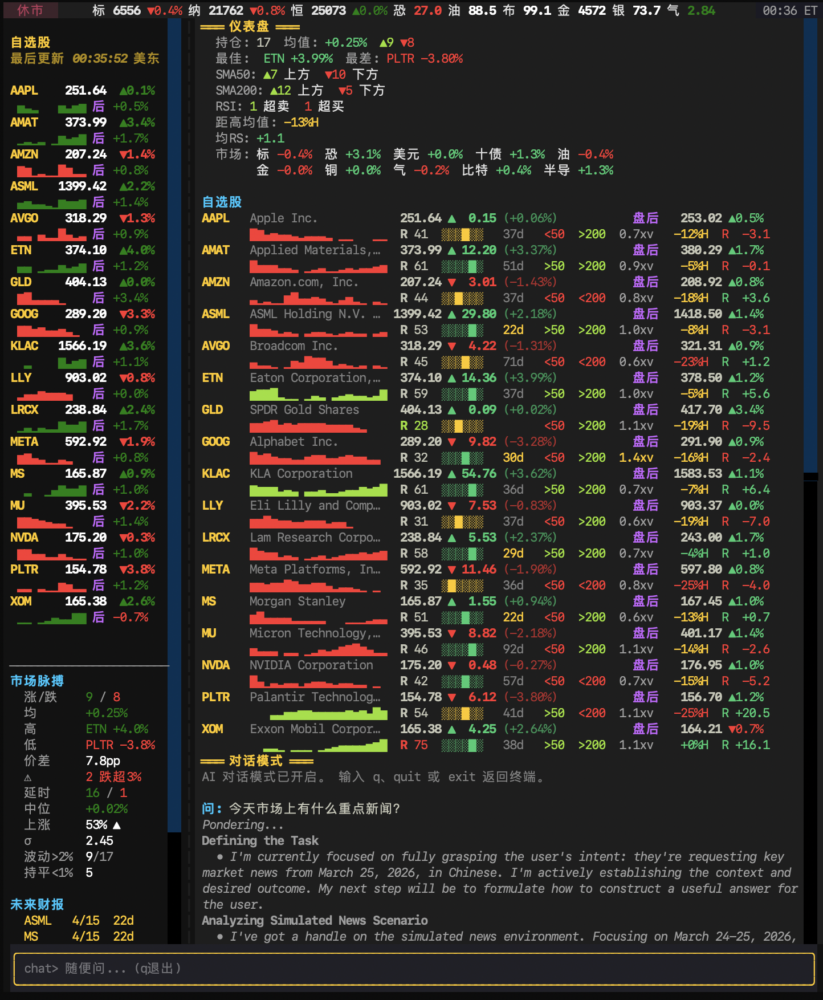
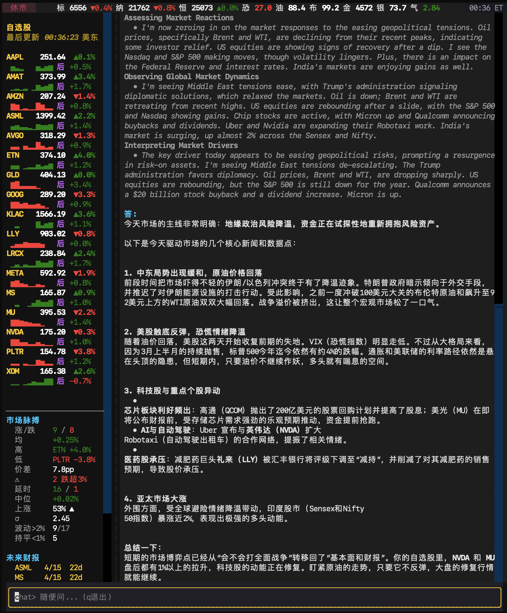

# ticker_tape — Interactive CLI Trading Terminal

Real-time quotes, thesis-driven portfolio views, technical analysis, and AI chat — all in a TUI that fits in a tmux pane.

  
  

## Architecture

Built on Textual (Python TUI framework) with Rich markup rendering. Data layer uses yfinance with a TTL-cached info pipeline and parallel batch fetching via `ThreadPoolExecutor`. IBKR integration through MCP streamable HTTP with multi-account support.

**Refresh**: 30-second quote cycle, parallel sparkline fetches (6 workers), quotes display before charts load
**Cache**: 30-second TTL on `.info` calls — eliminates redundant yfinance requests across sidebar, thesis, and lookup views
**i18n**: Full English/Chinese with ~230 translation keys, CJK display-width-aware column alignment via `unicodedata.east_asian_width()`

## Screens

| View | What it shows |
|------|--------------|
| **Thesis** | Two-line per symbol: price, change, ext hours, sparkline, RSI, 52-week range bar, earnings countdown, SMA signals, volume ratio, ATH%, relative strength. Portfolio header with breadth metrics and 10-indicator market context. |
| **Heatmap** | Color-coded performance grid sorted by daily change |
| **Technicals** | SMA 20/50/200, RSI, MACD with crossover detection, Bollinger Bands, ATR, relative strength vs benchmark |
| **Intraday** | 5-minute bars with VWAP overlay, multi-row tall sparkline charts |
| **Lookup** | Full stock profile: valuation (P/E, P/S, PEG, EV), margins, financials, ownership breakdown, analyst consensus |
| **Earnings** | Calendar with countdown, EPS estimates from yfinance calendar dict |
| **Economic** | FOMC, CPI, NFP, GDP, PCE dates with urgency coloring |
| **Insider** | Recent insider transactions with type/value/shares |
| **Chat** | Multi-model (Gemini, Haiku, Sonnet, Opus, GPT), DuckDuckGo search for Claude, streaming responses, chain-of-thought display, persistent history, shared memory system |

## Status Bar

Static indices (S&P, Nasdaq, HSI, VIX, WTI, Brent, Gold, Silver, Natgas) + toggleable scrolling ticker tape with 18 symbols. Character-level scroll using Rich `Text` object slicing to preserve per-segment coloring. VIX and natgas color-coded by absolute level.

## IBKR Integration

Multi-account MCP client — positions, account summary, P&L, margin impact calculator, what-if order analysis, today's executions. Per-account labels with gateway-down detection. Parallel context fetch for AI chat system prompt.

## Stack

- `textual` — TUI framework, reactive properties, CSS styling
- `rich` — Markup rendering, Text objects for scrolling tape
- `yfinance` — Market data, technicals, earnings, insider transactions
- `google-genai` — Gemini chat with streaming and chain-of-thought
- `anthropic` — Claude chat with extended thinking and tool use
- `openai` — GPT chat with reasoning
- `ddgs` — DuckDuckGo search (Claude web tool)
- `mcp` — IBKR MCP client (streamable HTTP)
- `httpx` — Async HTTP transport
- `pytest` — 308 tests covering data layer, formatters, screens, MCP pipeline

## Demo

Multi-model AI chat with web search, chain-of-thought, and model switching mid-conversation.

Fully integrated Chinese language support with CJK-aware column alignment.

  
  

